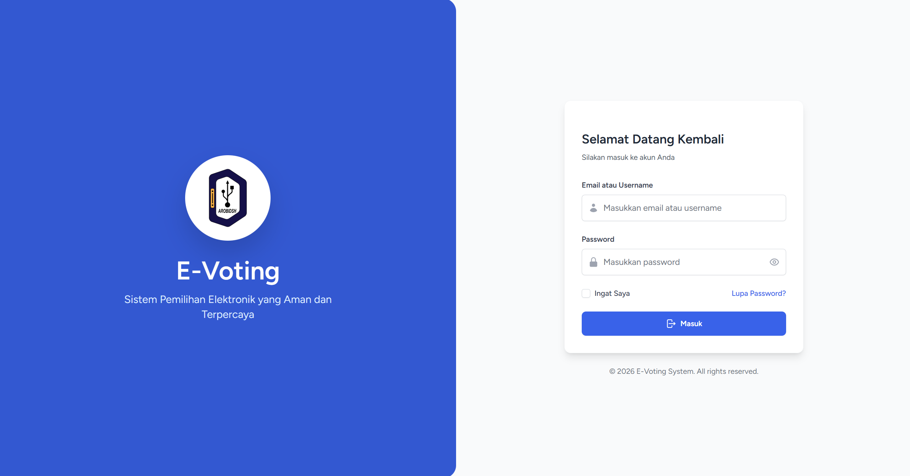
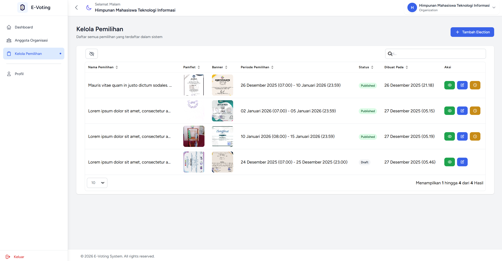
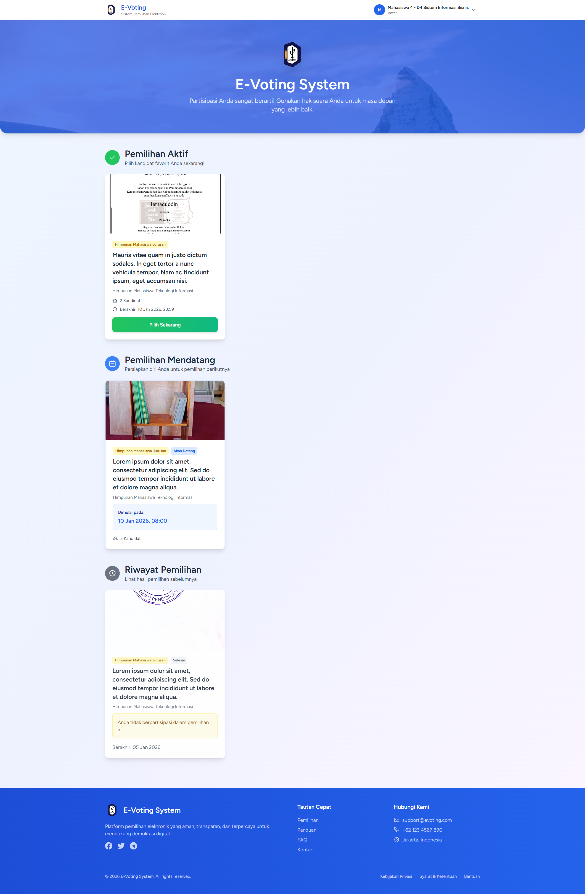
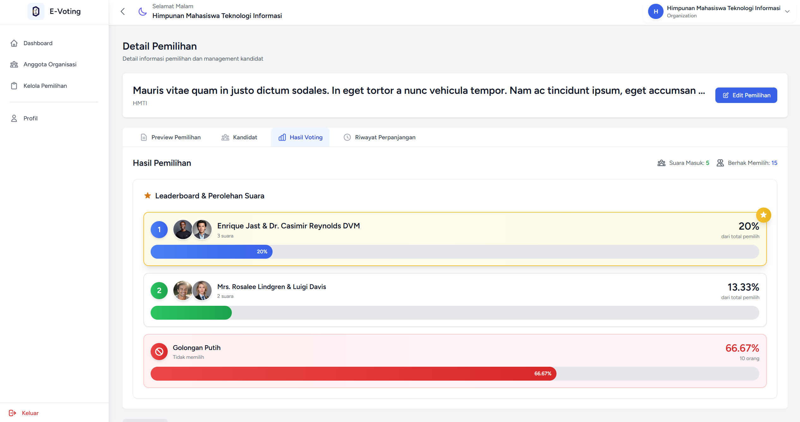
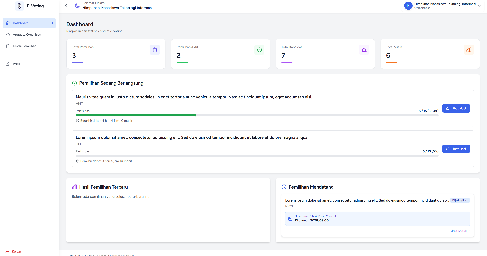

# E-Voting System

Sistem Pemilihan Elektronik berbasis web untuk organisasi kampus (BEM, DPM, HMJ, UKM) yang aman, modern, dan mudah digunakan.

---

## Tampilan Website

-   **Login**  
    
-   **Kelola Pemilihan**  
    
-   **Halaman Beranda Pemilih (Voter)**  
    
-   **Halaman Pemilihan**  
    
-   **Hasil Pemilihan**  
    
-   **Dashboard**  
    

---

## Daftar Isi

-   [Tentang Proyek](#-tentang-proyek)
-   [Fitur Utama](#-fitur-utama)
-   [Teknologi](#-teknologi)
-   [Persyaratan Sistem](#-persyaratan-sistem)
-   [Instalasi](#-instalasi)
-   [Role & Permission](#-role--permission)

---

## Tentang Proyek

**E-Voting System** adalah aplikasi web untuk mengelola pemilihan elektronik di lingkungan kampus. Sistem ini mendukung berbagai jenis organisasi dengan level akses yang berbeda:

-   **LT (Lembaga Tingkat Institusi)**: BEM, DPM - Pemilihan untuk seluruh mahasiswa aktif
-   **HMJ (Himpunan Mahasiswa Jurusan)**: Pemilihan khusus mahasiswa per jurusan
-   **UKM (Unit Kegiatan Mahasiswa)**: Pemilihan khusus anggota UKM terdaftar

### Tujuan Utama

-   Mempermudah proses pemilihan secara digital
-   Dapat digunakan oleh banyak organisasi (multi elections & scopes)
-   Meningkatkan partisipasi mahasiswa dalam pemilihan organisasi
-   Menjamin transparansi dan keamanan suara pemilih
-   Mengurangi biaya dan waktu penyelenggaraan pemilihan

---

## Fitur Utama

### Untuk Voter (Mahasiswa)

-   **Halaman Beranda Pemilihan**: Lihat daftar pemilihan aktif, mendatang, dan yang akan datang
-   **Sistem Voting**: Vote kandidat dengan konfirmasi dan enkripsi suara
-   **Filter Otomatis**: Hanya menampilkan pemilihan yang sesuai (berdasarkan jurusan/keanggotaan)
-   **Responsive Design**: Optimized untuk desktop, tablet, dan mobile

### Untuk Organization (Penyelenggara Pemilihan)

-   **Kelola Pemilihan**: Create, edit, publish, dan archive pemilihan
-   **Perpanjangan Waktu**: Extend waktu pemilihan dengan log riwayat
-   **Kelola Kandidat**: Upload foto, CV, visi-misi, dan profil kandidat
-   **Kelola Anggota**: Manage member organisasi
-   **Dashboard Analytics**: Statistik real-time voter turnout dan hasil

### Untuk Super Admin

-   **User Management**: Kelola seluruh user, role, dan permission
-   **Master Data**: Kelola jurusan, prodi, dan organisasi
-   **System Monitoring**: Pantau seluruh aktivitas sistem
-   **Report Generation**: Laporan data pemilihan

---

## Teknologi

-   **Laravel 12**
-   **Livewire 3**
-   **Livewire Volt**
-   **Spatie Laravel Permission**
-   **Laravel Breeze**
-   **MySQL**
-   **Tailwind CSS 3**:
-   **Alpine.js**
-   **Livewire PowerGrid** (Datatables)
-   **Notyf** (Toast notifications)

## Persyaratan Sistem

-   PHP >= 8.2
-   Composer >= 2.x
-   Node.js >= 18.x & NPM
-   Web Server (Apache/Nginx)

---

## Instalasi

### 1. Clone Repository

```bash
git clone https://github.com/Iemaduddin/e-voting.git
cd e-voting
```

### 2. Install Dependencies

```bash
# Install PHP dependencies
composer install

# Install Node.js dependencies
npm install
```

### 3. Setup Environment

```bash
# Copy environment file
cp .env.example .env

# Generate application key
php artisan key:generate
```

### 4. Konfigurasi Database

Edit file `.env` dan sesuaikan konfigurasi database:

```env
DB_CONNECTION=mysql
DB_HOST=127.0.0.1
DB_PORT=3306
DB_DATABASE=e_voting
DB_USERNAME=root
DB_PASSWORD=
```

### 5. Migrasi & Seeder

```bash
# Run migrations
php artisan migrate

# Seed initial data (roles, users, jurusan, prodi, organizations)
php artisan db:seed
```

### 6. Storage Link

```bash
php artisan storage:link
```

### 7. Build Assets

```bash
# Development
npm run dev

# Production
npm run build
```

### 8. Jalankan Server

```bash
composer run dev
```

Akses aplikasi di `http://127.0.0.1:8000`

---

## Role & Permission

### Roles

1. **Super Admin**

    - Full access ke seluruh sistem
    - User management
    - Master data management (jurusan, prodi)
    - System monitoring

2. **Organization**

    - Kelola pemilihan organisasi sendiri
    - Kelola kandidat
    - Kelola member
    - Lihat hasil pemilihan

3. **Voter**
    - Lihat pemilihan yang tersedia
    - Vote kandidat (sekali per pemilihan)

### Authorization Logic

**Voter Access to Election:**

-   **LT**: Semua mahasiswa aktif dengan role Voter
-   **HMJ**: Mahasiswa aktif dengan jurusan_id sama dengan organization creator
-   **UKM**: Mahasiswa aktif yang terdaftar di organization_members

---

## Developer

Dikembangkan oleh **Iemaduddin**

**Repository:** [https://github.com/Iemaduddin/e-voting](https://github.com/Iemaduddin/e-voting)

---

## Kontak & Support

Jika ada pertanyaan atau masalah, silakan buka [Issue](https://github.com/Iemaduddin/e-voting/issues) di GitHub.
